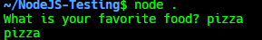

# CIN

This module allow you to make CLI in NodeJS

## Examples

In this example is expected this Input/Output



### CommonJS

```cjs
const { cin } = require('cin');

cin('What is your favorite food?').then(ans => console.log(ans));
// or
async function hello() {
    var ans = await cin('What is your favorite food?');
    console.log(ans);
}
hello();
```

### ModuleJS

```mjs
import { cin } from 'cin';


cin('What is your favorite food?').then(ans => console.log(ans));
// or
async function hello() {
    var ans = await cin('What is your favorite food?');
    console.log(ans);
}

hello();
```

### TypeScript

```ts
import { cin } from 'cin';


cin('What is your favorite food?').then(ans => console.log(ans));
// or
async function hello() {
    var ans = await cin('What is your favorite food?');
    console.log(ans);
}

hello();
```